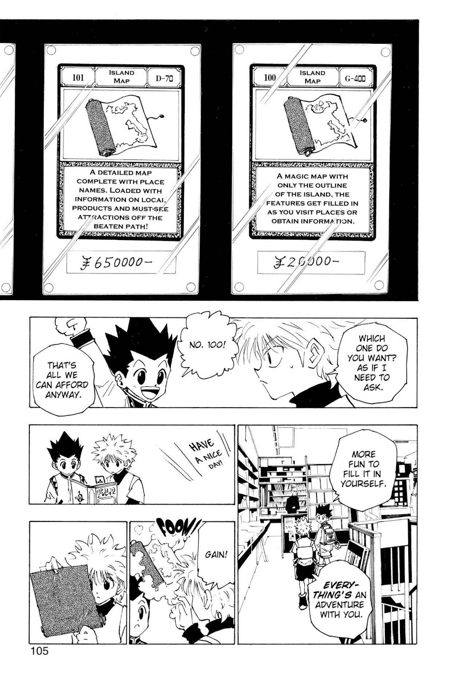
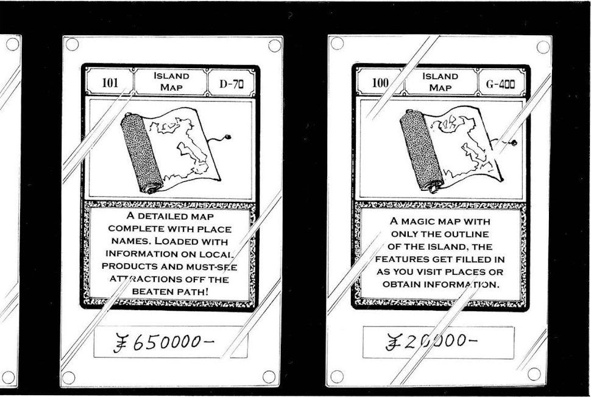
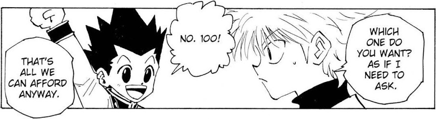
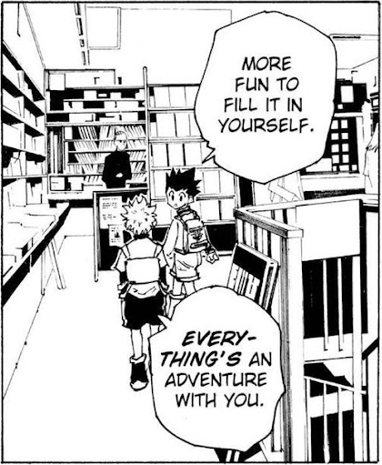
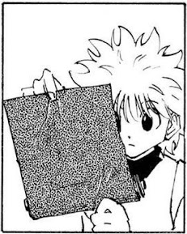
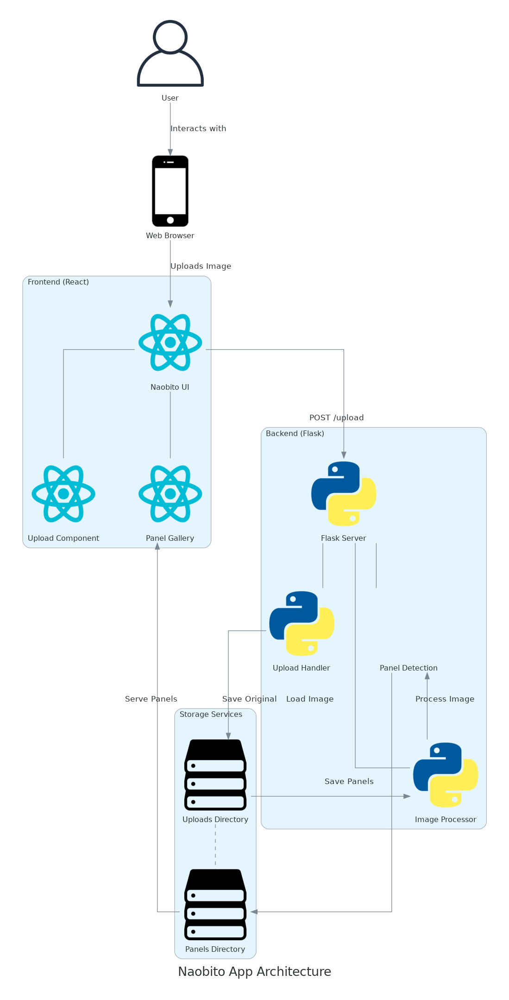
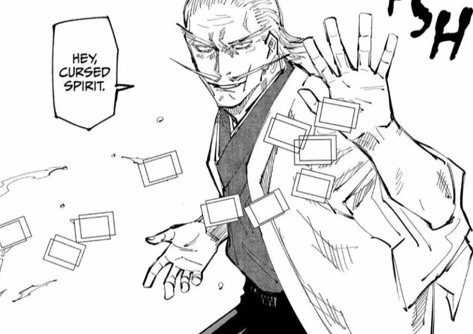

[](https://github.com/gongahkia/naobito/releases/tag/1.0.0) 

# `Naobito`

A simple Web App that creates Wallpapers from your [Manga](https://en.wikipedia.org/wiki/Manga) and [Comics](https://en.wikipedia.org/wiki/Comics).

Cooked up in [2.5 hours](https://github.com/gongahkia/naobito/commit/644a797b3db546288a5e88077592a0de0819edf4) to take a break from [finals studying](./asset/reference/finals.jpg).

<table>
  <tr>
    <td align="center" valign="top">
      
    </td>
    <td align="center" valign="middle" style="font-size: 48px; padding: 0 20px;">
      becomes...
    </td>
    <td align="left" valign="top">
      <br>
      <br>
      <br>
      <br>
      
    </td>
  </tr>
</table>

## Stack

* [*Frontend*](./naobito-app): React, JavaScript
* [*Backend*](./backend): Flask, Python

## Usage

Host `Naobito` locally by running the below.

```console
$ git clone https://github.com/gongahkia/naobito
$ cd naobito
$ sudo apt install graphviz
$ python3 -m venv myenv
$ pip install opencv-python numpy flask flask-cors opencv-python numpy diagrams
$ cd naobito-app
$ npm install axios
$ cd ..
$ python3 main.py
```

Then access the frontend at [localhost:3000](http://localhost:3000) and *(optionally)* the backend at [localhost:5000](http://localhost:5000).

## Architecture



## References

The name `Naobito` is in reference to [Naobito Zenin](https://jujutsu-kaisen.fandom.com/wiki/Naobito_Zenin), a [Special Grade 1](https://jujutsu-kaisen.fandom.com/wiki/Grade) [Jujutsu Sorcerer](https://jujutsu-kaisen.fandom.com/wiki/Jujutsu_Sorcerer) and the 26th head of the [Zenin Clan](https://jujutsu-kaisen.fandom.com/wiki/Sorcerer_Clan/Zenin_Clan). Naobito first makes an appearance in the [Shibuya Incident arc](https://jujutsu-kaisen.fandom.com/wiki/Shibuya_Incident_Arc) of the manga series [Jujutsu Kaisen](https://jujutsu-kaisen.fandom.com/wiki/Jujutsu_Kaisen_Wiki).

<div align="center">
    </img>
</div>
